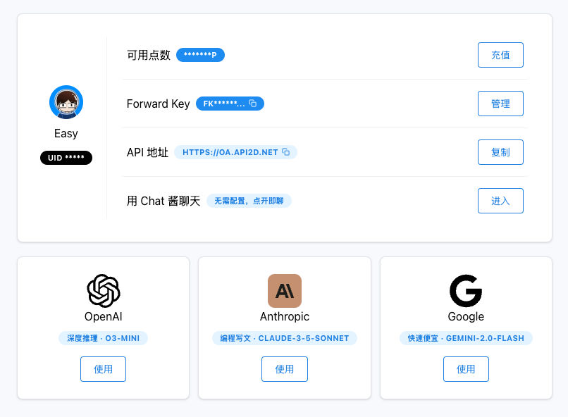

# ChainSillyTavern (CST联锁酒馆)

[English Documentation](README.md)

## 项目简介

ChainSillyTavern 是一个SillyTavern酒馆多实例管理系统，用于创建、管理和监控多个SillyTavern酒馆服务器实例。系统提供了 RESTful API 接口和现代化的管理界面，支持实例的创建、停止和删除等操作。

## 项目赞助商


API2D.com是知名AI接口服务平台，支持中国大陆直连、微信和银行卡支付。支持OpenAI、Claude和Gemini三大海外模型，其中Gemini和Google同价，很适合用来推长内容。[欢迎大家使用，点此注册作者可以收到点数](https://api2d.com/r/186008)。

## 授权
本项目采用 AGPL-3.0 许可证。

## 快速开始

需要一个 Linux 服务器，并且安装了 Node.js

### 克隆或者下载仓库代码

```bash
git clone https://github.com/easychen/CST.git
```

### 设置变量
复制 `factory-api/.env.example` 为 `factory-api/.env`，并修改其中的 `ADMIN_KEY` 管理员密码 和 `PORT` 端口参数。

### 配置SSL证书（可选）

将域名证书放到 `factory-api/certs` 目录：

- 证书：`factory-api/certs/cert.pem`
- 密钥：`factory-api/certs/privkey.pem`

### 全局安装 PM2
```bash
npm install pm2 -g
```

### 初始化并启动服务

> 服务器网络需要可以访问Github，否则请自行修改 `init.sh` 中的仓库地址

```bash
bash init.sh
```

## 项目结构

- `factory-api/`: 后端 API 服务
- `cst/`: 前端管理界面
- `stsource-changed/`: 修改版的 ST 源码

## 初始化项目

运行 `init.sh`，下载ST代码并覆盖修改版的代码（用于支持命令行传入basic密码）。

## 环境配置

### 前置要求

- Node.js (推荐 v14 或更高版本)
- PM2 (进程管理工具)

### 后端配置

在 `factory-api/.env` 文件中配置以下参数：

```env
# 管理员密钥配置
ADMIN_KEY=your-secret-admin-key

# 服务器端口配置
PORT=3000

# 环境配置
NODE_ENV=development
```

### 前端配置

在 `cst/.env.development` 文件中配置 API 地址：

```env
VITE_API_URL=http://localhost:3000
```

### SSL 配置

如需启用 SSL，可以通过以下命令行参数进行配置：

```bash
# 启用 SSL
--ssl=true

# 配置证书路径
--certPath=certs/cert.pem     # 证书文件路径
--keyPath=certs/privkey.pem   # 私钥文件路径
```

## 启动服务

### 启动后端 API

```bash
cd factory-api && npm run start
```

### 启动前端界面

开发模式：
```bash
cd cst && npm run dev
```

生产环境：
```bash
cd cst && npm run build
```

## API 接口文档

### 认证

所有 API 请求都需要在请求头中包含管理员密钥进行认证：

```http
X-ST-Admin-Key: your-secret-admin-key
```

### 创建SillyTavern酒馆实例

```http
POST /api/instances
Content-Type: application/json
X-ST-Admin-Key: your-secret-admin-key

{
    "port": 8001
}
```

响应示例：

```json
{
    "id": "st-instance-8001",
    "port": 8001,
    "dataDir": "/path/to/user-data/8001",
    "status": "running",
    "startTime": "2024-01-01T00:00:00.000Z",
    "password": "generated-uuid-for-basic-auth"
}
```

### 获取所有实例

```http
GET /api/instances
X-ST-Admin-Key: your-secret-admin-key
```

响应示例：

```json
[
    {
        "id": "st-instance-8001",
        "port": 8001,
        "status": "online",
        "startTime": "2024-01-01T00:00:00.000Z",
        "dataDir": "/path/to/user-data/8001"
    }
]
```

### 删除实例

```http
DELETE /api/instances/st-instance-8001
X-ST-Admin-Key: your-secret-admin-key
```

响应示例：

```json
{
    "message": "实例已删除"
}
```

## 错误处理

当发生错误时，API 将返回相应的 HTTP 状态码和错误信息：

```json
{
    "error": "错误信息"
}
```

常见错误：

- 400: 请求参数错误（如：缺少端口号）或端口已被占用
- 401: 缺少管理员密钥或管理员密钥无效
- 404: 实例不存在
- 500: 服务器内部错误（如：创建实例失败、获取实例列表失败、停止实例失败）

## 使用示例

### 创建并管理SillyTavern酒馆实例

```bash
# 创建新实例
curl -X POST http://localhost:3000/api/instances \
     -H "Content-Type: application/json" \
     -H "X-ST-Admin-Key: your-secret-admin-key" \
     -d '{"port": 8001}'

# 查询所有实例
curl http://localhost:3000/api/instances \
     -H "X-ST-Admin-Key: your-secret-admin-key"

# 停止实例
curl -X POST http://localhost:3000/api/instances/st-instance-8001/stop \
     -H "X-ST-Admin-Key: your-secret-admin-key"

# 删除实例
curl -X DELETE http://localhost:3000/api/instances/st-instance-8001 \
     -H "X-ST-Admin-Key: your-secret-admin-key"
``` 