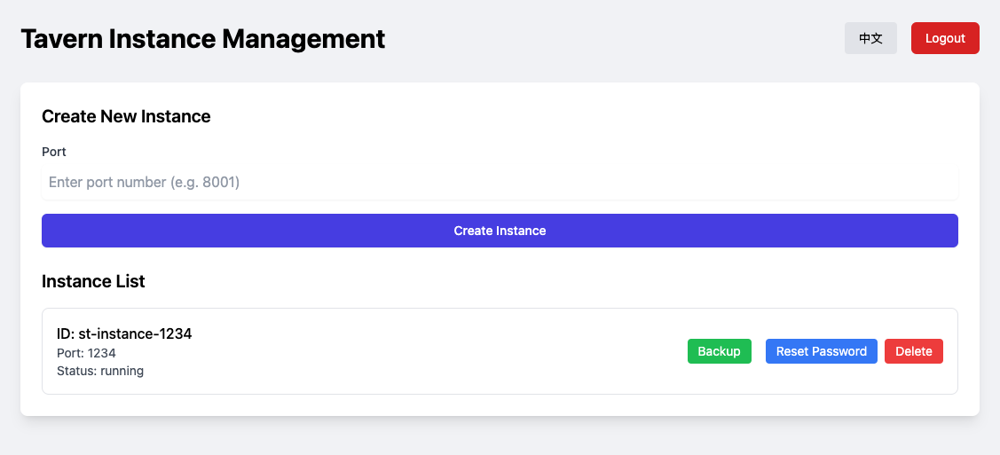
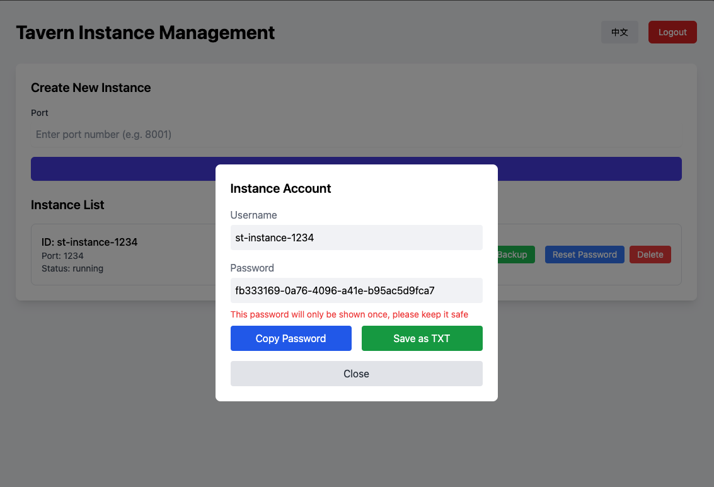

# ChainSillyTavern

[中文文档](README-zh.md) | [日本語ドキュメント](README-ja.md)





## Introduction

ChainSillyTavern is a SillyTavern instance management system designed for creating, managing, and monitoring multiple SillyTavern server instances. The system provides RESTful API interfaces and a modern management interface, supporting operations such as instance creation, stopping, and deletion.

## License
This project is licensed under AGPL-3.0.

## Quick Start

Requires a Linux server with Node.js installed.

### Clone or Download Repository

```bash
git clone https://github.com/easychen/CST.git
```

### Configure Environment Variables
Copy `factory-api/.env.example` to `factory-api/.env` and modify the `ADMIN_KEY` password and `PORT` parameters.

### Configure SSL Certificate (Optional)

Place domain certificates in the `factory-api/certs` directory:

- Certificate: `factory-api/certs/cert.pem`
- Private Key: `factory-api/certs/privkey.pem`

### Install PM2 Globally
```bash
npm install pm2 -g
```

### Initialize and Start Service

> Server network must be able to access Github, otherwise please modify the repository address in `init.sh`

```bash
bash init.sh
```

## Project Structure

- `factory-api/`: Backend API service
- `cst/`: Frontend management interface
- `stsource-changed/`: Modified ST source code

## Project Initialization

Run `init.sh` to download ST code and overwrite the modified version (to support command-line basic password input).

## Environment Configuration

### Prerequisites

- Node.js (v14 or higher recommended)
- PM2 (process management tool)

### Backend Configuration

Configure the following parameters in `factory-api/.env`:

```env
# Admin key configuration
ADMIN_KEY=your-secret-admin-key

# Server port configuration
PORT=3000

# Environment configuration
NODE_ENV=development
```

### Frontend Configuration

Configure API address in `cst/.env.development`:

```env
VITE_API_URL=http://localhost:3000
```

### SSL Configuration

To enable SSL, use the following command line parameters:

```bash
# Enable SSL
--ssl=true

# Configure certificate paths
--certPath=certs/cert.pem     # Certificate file path
--keyPath=certs/privkey.pem   # Private key file path
```

## Starting Services

### Start Backend API

```bash
cd factory-api && npm run start
```

### Start Frontend Interface

Development mode:
```bash
cd cst && npm run dev
```

Production environment:
```bash
cd cst && npm run build
```

## API Documentation

### Authentication

All API requests require an admin key in the request header:

```http
X-ST-Admin-Key: your-secret-admin-key
```

### Create SillyTavern Instance

```http
POST /api/instances
Content-Type: application/json
X-ST-Admin-Key: your-secret-admin-key

{
    "port": 8001
}
```

Response example:

```json
{
    "id": "st-instance-8001",
    "port": 8001,
    "dataDir": "/path/to/user-data/8001",
    "status": "running",
    "startTime": "2024-01-01T00:00:00.000Z",
    "password": "generated-uuid-for-basic-auth"
}
```

### Get All Instances

```http
GET /api/instances
X-ST-Admin-Key: your-secret-admin-key
```

Response example:

```json
[
    {
        "id": "st-instance-8001",
        "port": 8001,
        "status": "online",
        "startTime": "2024-01-01T00:00:00.000Z",
        "dataDir": "/path/to/user-data/8001"
    }
]
```

### Delete Instance

```http
DELETE /api/instances/st-instance-8001
X-ST-Admin-Key: your-secret-admin-key
```

Response example:

```json
{
    "message": "Instance deleted"
}
```

## Error Handling

When errors occur, the API will return appropriate HTTP status codes and error messages:

```json
{
    "error": "Error message"
}
```

Common errors:

- 400: Request parameter error (e.g., missing port number) or port already in use
- 401: Missing admin key or invalid admin key
- 404: Instance not found
- 500: Server internal error (e.g., failed to create instance, get instance list, or stop instance)

## Usage Examples

### Create and Manage SillyTavern Instances

```bash
# Create new instance
curl -X POST http://localhost:3000/api/instances \
     -H "Content-Type: application/json" \
     -H "X-ST-Admin-Key: your-secret-admin-key" \
     -d '{"port": 8001}'

# Query all instances
curl http://localhost:3000/api/instances \
     -H "X-ST-Admin-Key: your-secret-admin-key"

# Stop instance
curl -X POST http://localhost:3000/api/instances/st-instance-8001/stop \
     -H "X-ST-Admin-Key: your-secret-admin-key"

# Delete instance
curl -X DELETE http://localhost:3000/api/instances/st-instance-8001 \
     -H "X-ST-Admin-Key: your-secret-admin-key"
```
